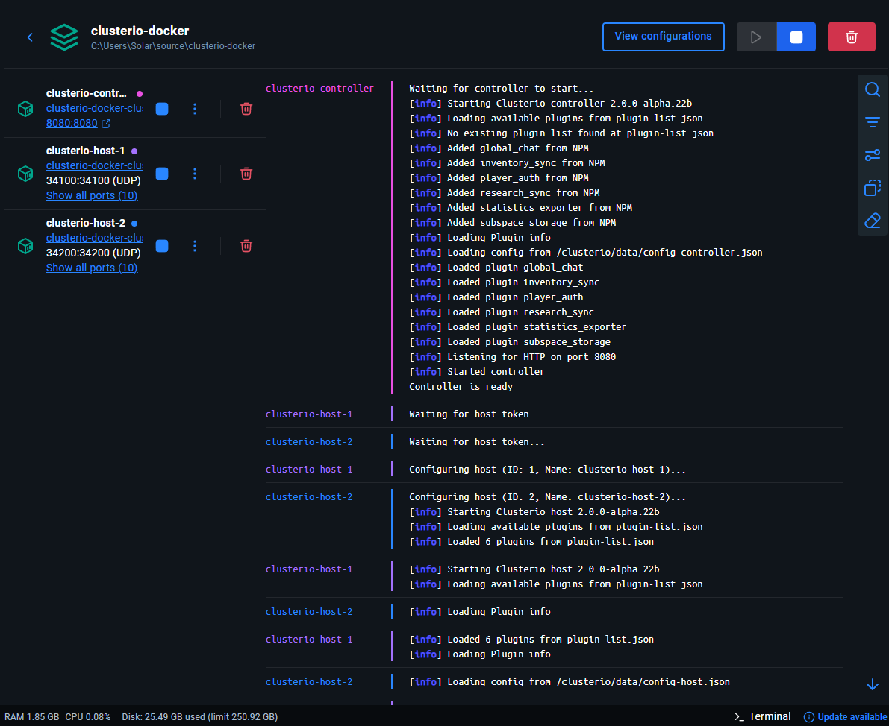

# Clusterio Docker

[](https://github.com/solarcloud7/clusterio-docker/actions/workflows/docker-build.yml)
[](https://www.npmjs.com/package/@clusterio/controller)
[](https://github.com/solarcloud7/clusterio-docker/pkgs/container/clusterio-docker-controller)
[](https://github.com/solarcloud7/clusterio-docker/pkgs/container/clusterio-docker-host)

Docker images for running [Clusterio](https://github.com/clusterio/clusterio) - a clustered Factorio server manager.

> **Consume, don't build.** `docker compose up -d` **pulls the prebuilt GHCR images** — you do
> not need to build anything to run a cluster. Building from source is a development activity
> (see [Building Locally](#building-locally)). **Agents/automation**: use the prebuilt images;
> do not build from source unless you are developing this repository itself.
> *(The Clusterio version badge above is CI-verified against the Dockerfiles on every build.)*

## Table of Contents

- [Images](#images)
- [Quick Start](#quick-start)
- [Standalone Usage](#standalone-usage)
- [Volume Mounts](#volume-mounts)
- [Environment Variables](#environment-variables)
- [Getting Host Tokens](#getting-host-tokens)
- [Seed Data](#seed-data)
- [Viewing Logs](#viewing-logs)
- [Prometheus Metrics](#prometheus-metrics)
- [Included Plugins](#included-plugins)
- [External Plugins](#external-plugins)
- [Asset Export — game client & export-data](docs/asset-export.md)
- [Plugin Development guide](docs/plugin-development.md)
- [Multi-cluster machines](docs/multi-cluster.md)
- [Clusterio engineering notes](docs/clusterio-engineering-notes.md)
- [Architecture](#architecture)
- [Troubleshooting](#troubleshooting)
- [Building Locally](#building-locally)
- [License](#license)

---

## Images

Pre-built images are published to the GitHub Container Registry:

| Image | Description |
|-------|-------------|
| `ghcr.io/solarcloud7/clusterio-docker-controller` | Web UI, API, and cluster coordination |
| `ghcr.io/solarcloud7/clusterio-docker-host` | Factorio server host (runs game instances) |

```bash
docker pull ghcr.io/solarcloud7/clusterio-docker-controller:latest
docker pull ghcr.io/solarcloud7/clusterio-docker-host:latest
```

### Image tags & provenance

Tags are published on **two axes** so version drift is a deliberate choice, not a rebuild
side-effect:

| Tag | Meaning | Mutability |
|-----|---------|------------|
| `:factorio-2.1.8-clusterio-2.0.0-alpha.27` | branch target **+** bundled Clusterio version | immutable pair — **pin this** |
| `:factorio-2.1.8` | the branch's latest build | moves on every rebuild (bundled Clusterio can change under it) |
| `:2.0.0-alpha.27` | bundled Clusterio version (default branch builds) | stable per Clusterio release |
| `:latest` | default branch's latest build | moves |

> **What the `factorio-*` axis means**: these images bundle **no Factorio bits** (see licensing
> note below — the host downloads the mod-pack's target *headless* version at runtime; the full
> client is never downloaded by Clusterio and can only be baked at build time with credentials via
> `INSTALL_FACTORIO_CLIENT`, and such images must stay private). So `factorio-2.1.8` denotes the
> **configuration/compatibility target** — entrypoint defaults, seeded mod pack, DLC enable list
> (e.g. `recycler` is a 2.1.x-specific dependency), and the Factorio version CI tests against —
> not baked game content. The **Clusterio version is the content-bearing half** of the pair tag,
> which is why `BUILD_INFO` records `clusterioVersion` and has no `factorioVersion` field.

### Branch model (why the default branch is `factorio-2.1.8`, not `main`)

**The default branch is the actively-maintained Factorio line** — currently `factorio-2.1.8` —
not `main`. This is deliberate (as of 2026-07-05) and not obvious out of the box:

| Branch | Role | Build target |
|--------|------|--------------|
| `factorio-2.1.8` (**default**) | The active line: all hardening, docs, CHANGELOG, and issue templates live here; `latest` + the Clusterio version tag publish from it | `custom` (fork branch `solarcloud7/clusterio@factorio-2.1.8`) |
| `main` | The npm-release line — **parked** until the npm release supports the current Factorio version (empirically: alpha.26 rejects 2.1-format mod `info.json` and lacks the `recycler` builtin) | `release` (npm `@clusterio/*`) |
| future `factorio-*` | New Factorio lines branch from the previous one | `custom` from the matching fork branch |

Practical consequences: `:latest` and the Clusterio version tag currently come from **custom
(fork) builds** — `BUILD_INFO`'s `clusterioTarget` field always records which target produced a
running image. When a Clusterio npm release lands that fully supports the current Factorio
line, `main` absorbs the active line and the default may move back. If you're reading this on
GitHub, you're already on the default (active) branch.

Every image also carries the label `io.clusterio.version` (readable via
`docker inspect -f '{{index .Config.Labels "io.clusterio.version"}}' <image>`) and a
**`/clusterio/BUILD_INFO`** file (`clusterioVersion`, `clusterioTarget`, `gitSha`, `builtAt`) so
a running container can answer "what am I?" with a file read:

```bash
docker exec clusterio-controller cat /clusterio/BUILD_INFO
```

> **Note**: Image names include `-docker-` because CI derives them from the repository name (`clusterio-docker`).

> **Factorio licensing**: these images do **not** bundle Factorio. The host downloads the Factorio headless server from official channels ([factorio.com](https://factorio.com)) at runtime — Wube's [Terms of Service](https://factorio.com/terms-of-service) do not permit redistributing the server. You are responsible for complying with Factorio's terms.

## Quick Start

### Using Docker Compose (Recommended)

1. Clone this repository:
   ```bash
   git clone https://github.com/solarcloud7/clusterio-docker.git
   cd clusterio-docker
   ```

2. Create your environment file:
   ```bash
   cp .env.example .env
   ```

3. Edit `.env` and set your admin username:
   ```env
   INIT_CLUSTERIO_ADMIN=your_username
   ```

4. Create the external volume for the Factorio game client (persists across `docker compose down -v`):
   ```bash
   docker volume create factorio-client
   ```

5. Start the cluster:
   ```bash
   docker compose up -d
   ```

6. Access the web UI at http://localhost:8080

---

## Standalone Usage

### Controller

```bash
docker run -d \
  --name clusterio-controller \
  -p 8080:8080 \
  -v controller-data:/clusterio/data \
  -v shared-tokens:/clusterio/tokens \
  -e INIT_CLUSTERIO_ADMIN=your_username \
  ghcr.io/solarcloud7/clusterio-docker-controller
```

### Host

```bash
docker run -d \
  --name clusterio-host \
  -p 34100-34199:34100-34199/udp \
  -v host-data:/clusterio/data \
  -v shared-tokens:/clusterio/tokens:ro \
  -e CLUSTERIO_HOST_TOKEN=your_host_token \
  -e CONTROLLER_URL=http://your-controller:8080/ \
  ghcr.io/solarcloud7/clusterio-docker-host
```

---

## Volume Mounts

Each container uses a single data volume for all persistent storage:

| Container | Volume Mount | Contents |
|-----------|--------------|----------|
| Controller | `/clusterio/data` | Config, database, mods, logs |
| Controller | `/clusterio/tokens` | Generated host tokens (shared) |
| Controller | `/clusterio/seed-data` | Seed data for first run (read-only bind mount) |
| Host | `/clusterio/data` | Config, instances, mods, logs |
| Host | `/clusterio/tokens` | Token from controller (read-only) |
| Host | `/clusterio/seed-mods` | Mod cache from seed data (read-only bind mount) |
| Host | `/opt/factorio-client` | Runtime-downloaded game client (`external: true`, survives `down -v`) |

### Data Volume Structure

```
# Controller /clusterio/data/
├── config-controller.json    # Controller configuration
├── database/                 # Users, hosts, instances, roles
└── (mods/, logs/ created as needed)

# Host /clusterio/data/
├── config-host.json          # Host configuration
├── instances/                # Game saves, instance configs
└── (mods/, logs/ created as needed)
```

> **Note**: Volumes are recommended but not required. Without mounts, data is lost when the container is removed.

### Bind Mount (Direct Host Access)

For direct access to files from your host machine:

```bash
# Controller
docker run -d -p 8080:8080 \
  -v ./data/controller:/clusterio/data \
  -v ./tokens:/clusterio/tokens \
  -e INIT_CLUSTERIO_ADMIN=admin \
  ghcr.io/solarcloud7/clusterio-docker-controller

# Host  
docker run -d -p 34100-34199:34100-34199/udp \
  -v ./data/host:/clusterio/data \
  -v ./tokens:/clusterio/tokens:ro \
  -e CLUSTERIO_HOST_TOKEN=your_token \
  ghcr.io/solarcloud7/clusterio-docker-host
```

---

## Environment Variables

### Controller

| Variable | Default | Description |
|----------|---------|-------------|
| `INIT_CLUSTERIO_ADMIN` | *(required)* | Admin username for first run |
| `CONTROLLER_HTTP_PORT` | `8080` | Web UI / API port |
| `CONTROLLER_PUBLIC_ADDRESS` | *(unset)* | Public URL for external access (standalone usage) |
| `HOST_COUNT` | `0` (standalone) / `2` (compose) | Number of host tokens to generate |
| `DEFAULT_MOD_PACK` | `Base Game 2.1` (standalone) / `Space Age 2.1` (compose) | Default mod pack for new instances (first run only). Created automatically if not found. |
| `DEFAULT_FACTORIO_VERSION` | `2.1` | Factorio version used when creating a new mod pack (only applies when `DEFAULT_MOD_PACK` doesn't match an existing pack) |
| `FACTORIO_USERNAME` | *(unset)* | Factorio account username (for mod portal & multiplayer) |
| `FACTORIO_TOKEN` | *(unset)* | Factorio account token from [factorio.com/profile](https://factorio.com/profile) |
| `EXPORT_HOST` | `1` (compose) / `0` (skip) | Host ID whose instance runs `export-data` (web-UI icons/prototypes) during first-run seeding — that host needs the game client. See [Asset Export](docs/asset-export.md). |
| `CONTROLLER_STATIC_CACHE_MODE` | `revalidate` | `/static` cache headers: `revalidate` (default — non-hashed web-UI assets stay fresh across upgrades) or `immutable` (stock Clusterio behavior) |
| `CLUSTERIO_LOG_TO_STDOUT` | `true` | Mirror the on-disk cluster/host logs (plugin logger output) to container stdout with a `[cluster-log]` prefix |

### Host

| Variable | Default | Description |
|----------|---------|-------------|
| `CLUSTERIO_HOST_TOKEN` | *(auto from shared volume)* | Host authentication token |
| `CONTROLLER_URL` | `http://clusterio-controller:8080/` | Controller URL |
| `HOST_NAME` | Container hostname | Host identifier (must match token file name) |
| `FACTORIO_USERNAME` | *(unset)* | Factorio.com username — triggers runtime game client download on first startup |
| `FACTORIO_TOKEN` | *(unset)* | Factorio.com token from [factorio.com/profile](https://factorio.com/profile) |
| `FACTORIO_CLIENT_BUILD` | `expansion` | Runtime client variant: `expansion` (Space Age) or `alpha` (base game) |
| `FACTORIO_CLIENT_TAG` | `stable` | Factorio client version tag for runtime download |
| `SKIP_CLIENT` | `false` | Force headless server even when the game client is available |
| `FACTORIO_PORT_RANGE` | Auto from host ID | Override the auto-derived game port range (e.g., `34100-34199`) |

### Build Arguments

These are set at build time via `docker compose build` or `--build-arg`. In docker-compose.yml they are interpolated from `.env`.

| Variable | Default | Description |
|----------|---------|-------------|
| `CLUSTERIO_TARGET` | `release` | `release` (npm packages) or `custom` (build from the bundled `clusterio/` source) |
| `CLUSTERIO_VERSION` | `2.0.0-alpha.27` | Pinned Clusterio version for the `release` target — all `@clusterio/*` packages install at this version. Ignored by `custom`. |
| `NODE_IMAGE` | `node:24-bookworm-slim@sha256:…` | Base Node image, pinned by digest for reproducible builds |
| `BAKE_FACTORIO_HEADLESS` | `false` | Bake Factorio headless into the image. **Default `false`** — images ship no Factorio (Wube's EULA forbids redistributing it); Clusterio downloads it at runtime. Set `true` only for private/offline images. |
| `FACTORIO_HEADLESS_TAG` | `stable` | Factorio headless version to bake (only used when `BAKE_FACTORIO_HEADLESS=true`) |
| `FACTORIO_HEADLESS_SHA256` | *(unset)* | SHA256 checksum for the baked headless archive (bake-only; skips verification if empty) |
| `INSTALL_FACTORIO_CLIENT` | `false` | Install full game client for graphical asset export (host only) |
| `FACTORIO_CLIENT_BUILD` | `expansion` | Client variant: `alpha` (base game) or `expansion` (Space Age) |
| `FACTORIO_CLIENT_TAG` | `stable` | Factorio client version tag |
| `FACTORIO_CLIENT_USERNAME` | *(unset)* | Factorio.com username (required when `INSTALL_FACTORIO_CLIENT=true`) |
| `FACTORIO_CLIENT_TOKEN` | *(unset)* | Factorio.com token (required when `INSTALL_FACTORIO_CLIENT=true`) |
| `FACTORIO_CLIENT_SHA256` | *(unset)* | SHA256 checksum for game client archive (skips verification if empty) |
| `CURL_RETRIES` | `8` | Number of curl retry attempts for Factorio downloads |

> **Note**: The build-time client path is only needed for private images. For most users, the **runtime download** (set `FACTORIO_USERNAME` + `FACTORIO_TOKEN` as host env vars) is simpler and more secure — credentials never appear in image layers.

---

## Getting Host Tokens

### Option 1: Shared Volume (Docker Compose)

When using docker-compose, the controller automatically generates tokens based on `HOST_COUNT` and saves them to a shared volume. Hosts read tokens from this volume automatically.

**Important:** For auto-token loading to work, hosts must be named `clusterio-host-N` where N matches the host ID:

| Host Name | Token File | Host ID |
|-----------|------------|---------|
| `clusterio-host-1` | `clusterio-host-1.token` | 1 |
| `clusterio-host-2` | `clusterio-host-2.token` | 2 |
| `clusterio-host-3` | `clusterio-host-3.token` | 3 |

The host extracts its numeric ID from its name (e.g., `clusterio-host-1` → ID `1`).

### Option 2: Manual Token (Standalone)

For standalone containers or custom host names:

1. Start the controller
2. Generate a token via CLI:
   ```bash
   docker exec clusterio-controller npx clusteriocontroller bootstrap generate-host-token 1
   ```
3. Pass the token to host via `CLUSTERIO_HOST_TOKEN` environment variable:
   ```bash
   docker run -d \
     -v host-data:/clusterio/data \
     -e CLUSTERIO_HOST_TOKEN=eyJhbGci... \
     -e CONTROLLER_URL=http://your-controller:8080/ \
     ghcr.io/solarcloud7/clusterio-docker-host
   ```

### Option 3: Web UI

1. Log into the controller web UI
2. Navigate to Hosts → Create Host Token
3. Use the generated token

---

## Seed Data

Pre-populate your cluster with users, roles, mods, instances, and saves on first run using the `seed-data/` folder convention:

```
seed-data/
├── controller/
│   └── database/          # users.json, roles.json (copied before controller starts)
├── mods/                  # Factorio mod .zip files (uploaded to controller)
└── hosts/
    └── clusterio-host-1/  # Must match docker-compose hostname
        └── MyInstance/
            ├── instance.json  # Optional: instance config overrides
            └── world.zip      # Save file to upload
```

On first run (clean volumes), the controller automatically:
1. Seeds database files (users, roles)
2. Uploads mods to the controller
3. Creates instances, assigns them to hosts, uploads saves
4. Applies instance configuration from `instance.json` (server settings, plugins, etc.)
5. Starts instances automatically (override with `instance.auto_start: false` in `instance.json`)

Hosts pre-cache mods locally from the seed-data mount on every startup for faster instance starts.

> See [docs/seed-data.md](docs/seed-data.md) for full documentation including examples, config options, and troubleshooting.

---

## Viewing Logs

> **Plugin logs stream to stdout.** Clusterio routes plugin logger output
> (`this.logger.*`) to files on disk — historically invisible in `docker logs` and "the #1
> gotcha that wastes hours." These images now mirror those files to container stdout, prefixed
> `[cluster-log] `, so `docker logs clusterio-host-1 | grep '\[cluster-log\]'` shows your
> plugin's lines. Opt out with `CLUSTERIO_LOG_TO_STDOUT=false`. The raw files remain at
> `/clusterio/logs/cluster/` (controller) and `/clusterio/logs/host/` (hosts); engine/module
> Lua output stays in the instance's `factorio-current.log`.

### Dozzle

[Dozzle](https://github.com/amir20/dozzle) is a lightweight, real-time log viewer for Docker containers with a clean web UI. Great for monitoring multiple containers in one place.

### Docker Desktop 

Docker Desktop provides an excellent built-in log viewer with a merged timeline from all containers:




### Command Line

```bash
# View logs from a specific container
docker logs clusterio-controller

# Follow logs in real-time
docker logs -f clusterio-host-1

# Show last 100 lines
docker logs --tail 100 clusterio-host-2

# Show logs with timestamps
docker logs -t clusterio-controller
```

---

## Prometheus Metrics

The docker-compose setup includes an optional (commented-out) Prometheus container for collecting metrics from the `statistics_exporter` plugin. Uncomment the `prometheus` service in `docker-compose.yml` to enable it.

### Access

- **Prometheus UI**: http://localhost:9090
- **Controller metrics**: http://localhost:8080/metrics

### Configuration

Edit [scripts/prometheus.yml](scripts/prometheus.yml) to customize scrape targets:

```yaml
scrape_configs:
  - job_name: 'clusterio-controller'
    static_configs:
      - targets: ['clusterio-controller:8080']
    metrics_path: /metrics

  - job_name: 'clusterio-hosts'
    static_configs:
      - targets:
          - 'clusterio-host-1:8080'
          - 'clusterio-host-2:8080'
    metrics_path: /metrics
```

### Available Metrics

The `statistics_exporter` plugin exposes metrics including:

- `clusterio_controller_connected_hosts` - Number of connected hosts
- `clusterio_instance_*` - Per-instance game statistics
- `clusterio_player_*` - Player activity metrics

After changes, restart Prometheus:
```bash
docker compose restart prometheus
```

---

## Included Plugins

Both images include these official plugins:

- `global_chat` - Cross-server chat
- `inventory_sync` - Sync player inventories
- `player_auth` - Player authentication
- `research_sync` - Sync research progress
- `statistics_exporter` - Prometheus metrics
- `subspace_storage` - Shared item storage

---

## External Plugins

To use external Clusterio plugins, mount a plugins directory into the containers:

1. Uncomment the external plugins volume in `docker-compose.yml` for the controller and each host
2. Place plugin directories (each containing a `package.json`) in the `plugins/` folder
3. Plugins are automatically installed on container startup

> **Important**: The plugins mount must NOT be read-only (`:ro`). The entrypoint runs `npm install` inside each plugin directory.

> **Developing a plugin?** See the [Plugin Development guide](docs/plugin-development.md) —
> dev loop, the require-cache and boot-race traps, log locations, and a worked example.

### The install contract (what the entrypoint does to your plugin)

For each immediate subdirectory of the mount that contains a `package.json`, on every container
start the entrypoint (`scripts/install-plugins.sh`):

1. `chown -R clusterio:clusterio` on the plugins dir, then runs `npm install --omit=dev` inside
   the plugin **as the clusterio user**.
2. An install failure is **non-fatal**: a `WARNING` is written to stderr (greppable in
   `docker logs`) and startup continues — a broken plugin won't take down the cluster, but it
   also won't be silently absent; check the logs.
3. **Strips `node_modules/@clusterio` from the plugin afterwards.** Clusterio fatally rejects a
   duplicate `@clusterio/lib` import, and npm 7+ auto-installs peerDependencies — so a vendored
   copy would crash every `clusterioctl` invocation cluster-wide. Never ship or bake `@clusterio/*`
   inside a plugin's `node_modules`; keep those as peerDependencies and let the image's copy win.

### Operational note: the instance/plugin boot race

Instance plugins are only loaded if the plugin is present in the controller's WebSocket `hello`
when the instance starts. If an instance **auto-starts before its host finishes the controller
handshake** (e.g. right after `docker compose up -d` or a host container restart), instance
plugins can be **silently skipped — no error, IPC just goes nowhere**.

**The host entrypoint now guards this automatically**: once the controller reports the host
connected, a background **boot-race guard** restarts any instance that started *before* the
handshake (detected via `startedAtMs`), so its plugins register. Healthy boots are untouched.
Look for `boot-race guard:` lines in the host's `docker logs`.

The manual protocol below still applies to **standalone hosts** (no shared tokens volume — the
guard needs `config-control.json` and skips without it), and remains sound belt-and-suspenders
after any deploy:

1. Wait for controller and host containers to be healthy.
2. `clusterioctl instance stop <name>` then `instance start <name>`.
3. **Verify a plugin behavior** (a plugin command or a data write), not just "the instance runs".

Also note: instance restarts re-patch save-embedded **Lua** modules, but a host that has already
loaded a plugin's **Node** code keeps serving it from the require cache — after changing plugin
Node code, restart the **host container**, not just the instance.

---

## Architecture

```
                    ┌─────────────────────────────┐
                    │        Prometheus           │
                    │  - Metrics collection       │
                    │  - Query UI (port 9090)     │
                    └──────────────┬──────────────┘
                                   │ scrapes
                                   ▼ /metrics
┌─────────────────────────────────────────────────────────┐
│                    Controller                           │
│  - Web UI (port 8080)                                   │
│  - REST API                                             │
│  - Cluster coordination                                 │
│  - User/role management                                 │
└──────────────────────┬──────────────────────────────────┘
                       │
         ┌─────────────┼─────────────┐
         │             │             │
         ▼             ▼             ▼
┌───────────┐  ┌───────────┐  ┌───────────┐
│  Host 1   │  │  Host 2   │  │  Host N   │
│           │  │           │  │           │
│ Instance  │  │ Instance  │  │ Instance  │
│ Instance  │  │ Instance  │  │ Instance  │
└───────────┘  └───────────┘  └───────────┘
```

---

## Troubleshooting

### Permission Denied Errors

The containers use `gosu` to handle volume permissions automatically. If you still see permission errors:

```bash
# Fix permissions on bind mounts
sudo chown -R 1000:1000 ./data/controller
sudo chown -R 1000:1000 ./data/host
```

### Host Can't Connect to Controller

1. Ensure controller is healthy: `docker compose ps`
2. Check controller logs: `docker logs clusterio-controller`
3. Verify `CONTROLLER_URL` is correct (use Docker network name, not localhost)
4. Check token is valid

### Container Keeps Restarting

Check logs for errors:
```bash
docker logs clusterio-controller
docker logs clusterio-host-1
```

### RCON answers but plugins seem frozen

A headless server with Factorio's default `auto_pause: true` **pauses at 0 connected players**
— every `on_tick`-driven plugin pipeline silently stops while RCON keeps responding, so the
cluster *looks* alive. Set `"factorio.settings": { "auto_pause": false }` in the instance
config (seedable — see [docs/seed-data.md](docs/seed-data.md)); the seeder logs an INFO when an
instance is created without an explicit setting.

### Changing DEFAULT_MOD_PACK after first run

`DEFAULT_MOD_PACK` is applied **on first run only** — changing the env later does nothing (and
`down -v` to force a re-seed destroys cluster data). Instead, reassign the pack live:

```bash
docker exec clusterio-controller npx clusterioctl \
  --config /clusterio/tokens/config-control.json \
  instance config set <instance> factorio.mod_pack <pack-name-or-id>
```

(Repeat per instance; `mod-pack list` shows names and ids.)

### Two clusters on one machine collide

Ports, container names, and **external volume names** are global to the Docker host. See
[docs/multi-cluster.md](docs/multi-cluster.md) for the four collision surfaces and the `.env`
knobs (`HOST1_PORTS`, `HOST2_PORTS`, `FACTORIO_CLIENT_VOLUME`).

---

## Building Locally

The base `docker-compose.yml` is consumer-first — it **pulls** images and contains no build
configuration. Source builds live in the `docker-compose.dev.yml` overlay:

```bash
# Build both images from source (release target = @clusterio/* from npm)
docker compose -f docker-compose.yml -f docker-compose.dev.yml build

# Run what you built (local build overrides the pulled image name)
docker compose -f docker-compose.yml -f docker-compose.dev.yml up -d

# Core development: build from a local Clusterio monorepo checkout instead of npm
#   1. clone your clusterio fork to ./clusterio/
#   2. set CLUSTERIO_TARGET=custom in .env
#   3. build with the overlay as above

# Build individually (without compose)
docker build -f Dockerfile.controller -t clusterio-controller .
docker build -f Dockerfile.host -t clusterio-host .
```

---

## License

MIT License - See [LICENSE](LICENSE) for details.

## Links

- [Clusterio GitHub](https://github.com/clusterio/clusterio)
- [Clusterio Documentation](https://github.com/clusterio/clusterio/blob/master/docs/readme.md)
